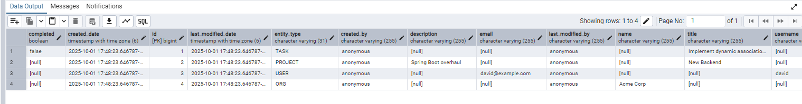
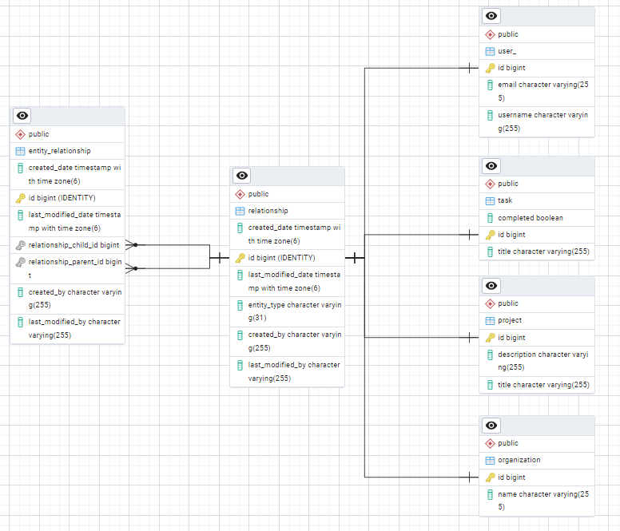
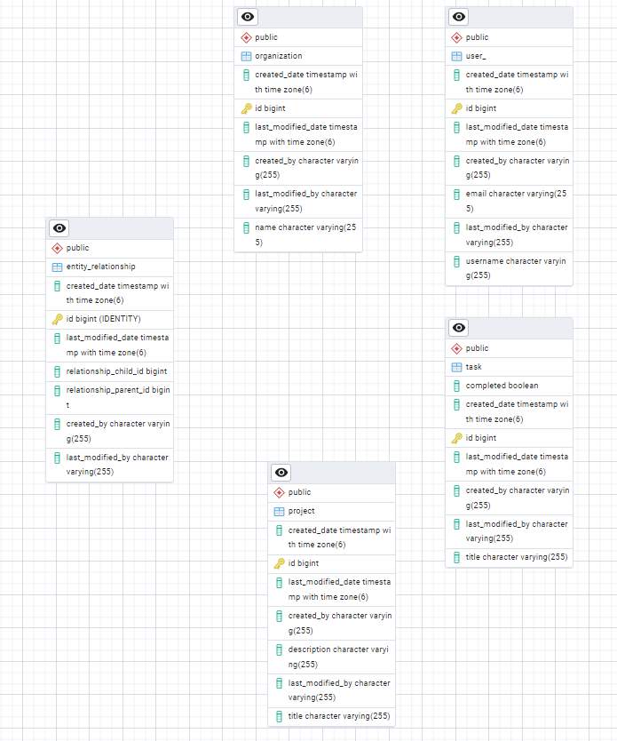

# Single Table Inheritance Approach

This repository demonstrates the **Single Table Inheritance (STI)** strategy for modeling inheritance in relational
databases. All entities in an inheritance hierarchy are stored in a single database table, differentiated by a type
discriminator column.

## Approach

- **Single Table**: All subclasses/entities share the same table.
- **Discriminator Column**: Identifies the type/subclass of each row.
- **Flexible Attributes**: Non-shared attributes are nullable or managed with default values.
- **Simple Queries**: Fetch records for the entire hierarchy or filter by type.

This approach is useful for scenarios with polymorphic relationships and straightforward data requirements.

## Use with EAV Model

STI is especially helpful when using the **Entity-Attribute-Value (EAV)** model to support custom fields or dynamic
attributes. It simplifies storing and querying heterogeneous data types within a single table structure.

## Advantages

- Simplifies schema management by reducing the number of tables.
- Easy to query all types at once.
- Good performance for small to medium-sized hierarchies.

## ERD Diagram

Example of the Single Table Inheritance structure.

---

## Join Table Inheritance Approach

Each subclass/entity gets its own table, and a join is used to reconstruct the full object.

### Key Points

- **Separate Tables**: Each subclass has its own table in addition to the base table.
- **Joins Required**: Queries joining base and subclass tables reconstruct the entity.
- **No Nullable Columns**: Each table only contains relevant attributes for the subclass.

#### How to Use

It's literally just changing the `@Inheritance(strategy = InheritanceType.SINGLE_TABLE)` annotation to  
`@Inheritance(strategy = InheritanceType.JOINED)` in your entity classes.

#### Advantages

- No wasted space for unused fields (no nullable columns for subclass-only attributes).
- Cleaner data separation for complex hierarchies.

---

## ERD Diagram

---

## Table Per Class Inheritance Approach

Each concrete class in the inheritance hierarchy is mapped to its own table. Tables are not related by foreign keys, and
each contains all fields inherited from the base class.

### Key Points

- **Separate Tables**: Each concrete subclass has its own table, including inherited fields.
- **No Referential Integrity**: There is no foreign key relationship between tables. Each table stands alone.
- **No Shared Primary Key**: Each table manages its own primary keys.
- **Polymorphic Queries**: Queries across the hierarchy are performed with `UNION` statements.

#### Importance of Referential Integrity

With this approach, **referential integrity is not enforced** at the database level, which can lead to data
inconsistency if not managed carefully. You must ensure integrity through application logic.

#### How to Use

Change the `@Inheritance` annotation to  
`@Inheritance(strategy = InheritanceType.TABLE_PER_CLASS)` in your entity classes.

#### Advantages

- Fully independent tables for each subclass.
- Useful for hierarchies where subclasses do not share data and are queried independently.

---

## ERD Diagram

---

For more details on implementation, see the code and comments in this repository.