# Inheritance & Polymorphic Association Strategies with Hibernate

This repository demonstrates five approaches for modeling inheritance and polymorphic associations in relational
databases using JPA/Hibernate:

1. **Single Table Inheritance**
2. **Join Table (Joined) Inheritance**
3. **Table Per Class Inheritance**
4. **Any Discriminator Approach**
5. **One-to-One with Any Discriminator Approach**

## Comparison Table

| Approach                           | Flexibility | Referential Integrity | Query Performance | Schema Simplicity | Best Use Case                                        |
|------------------------------------|-------------|-----------------------|-------------------|-------------------|------------------------------------------------------|
| **Single Table Inheritance**       | Low         | Yes                   | Fast (no joins)   | Simple            | Small hierarchies with many shared fields            |
| **Join Table Inheritance**         | Medium      | Yes                   | Slower (joins)    | Moderate          | Complex hierarchies with distinct fields             |
| **Table Per Class**                | Low         | No                    | Slower (UNION)    | Fragmented        | Independent subclasses, rarely queried together      |
| **Any Discriminator**              | High        | No (app-level only)   | Moderate          | Simple generic    | Generic relationships, activity feeds                |
| **One-to-One + Any Discriminator** | Medium      | Yes                   | Moderate          | Simple            | Polymorphic one-to-one links with enforced integrity |

---

## 1. Single Table Inheritance

All entities in a hierarchy are stored in a **single table**, distinguished by a discriminator column.

### Key Points

- **Single Table**: One table holds all subclass data.
- **Discriminator Column**: Identifies which subclass a row represents.
- **Nullable Columns**: Non-shared attributes appear as nullable for unrelated types.

### Pros

- Simplifies schema (one table only).
- Easy to query across hierarchy.
- Good performance for small/medium hierarchies.

### Cons

- Lots of null columns if subclasses differ heavily.
- Schema can become “wide” and messy.
- Harder to evolve when subclasses diverge a lot.

### ERD Diagram

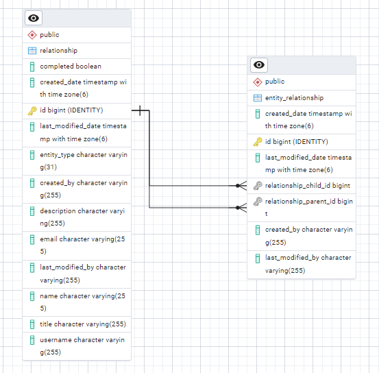

entity_relationship table:

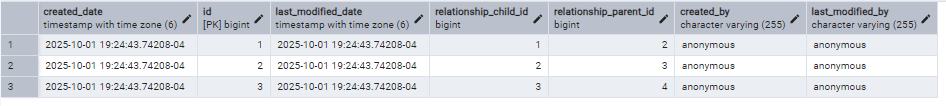

relationship table:

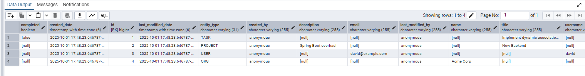

---

## 2. Join Table (Joined) Inheritance

Each subclass gets its own table. The base class table holds shared attributes, and subclass tables hold specific ones.

### Key Points

- **Joined Tables**: Queries reconstruct full entities with joins.
- **No Null Columns**: Each table has only its relevant attributes.

### Pros

- Clean separation of subclass fields.
- No wasted space.
- Referential integrity is preserved between base and subclass.

### Cons

- Requires joins for polymorphic queries.
- More complex queries (can impact performance).

### ERD Diagram

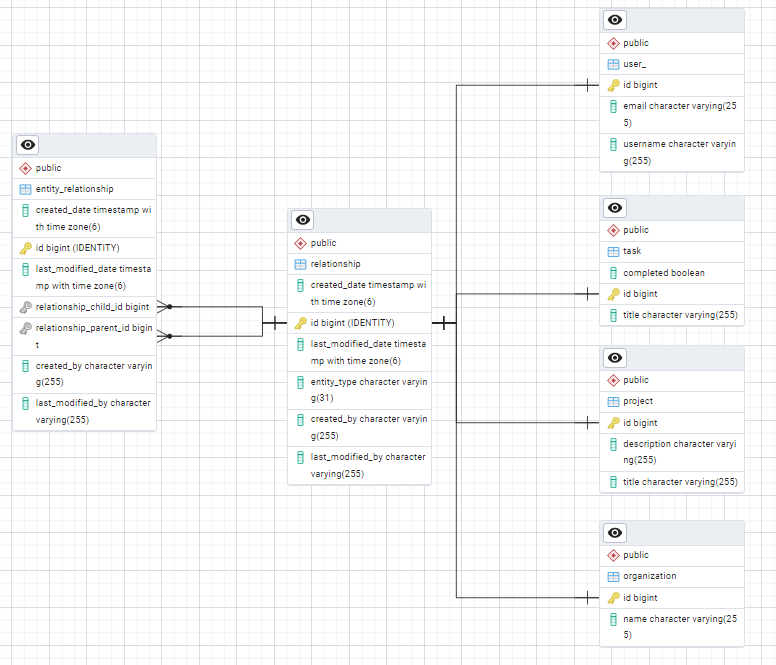

entity_relationship table:

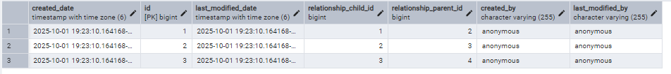

relationship table:

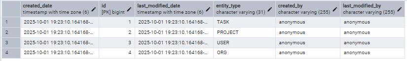

---

## 3. Table Per Class Inheritance

Each concrete class has its own full table, including inherited fields. No shared base table.

### Key Points

- **Independent Tables**: No foreign keys between subclass tables.
- **Polymorphic Queries**: Hibernate generates `UNION` across tables.

### Pros

- Each table is self-contained.
- Good if subclasses are rarely queried together.

### Cons

- No referential integrity at the DB level for the hierarchy.
- Polymorphic queries can be slow (use UNION).
- Duplicate schema between tables.

### ERD Diagram

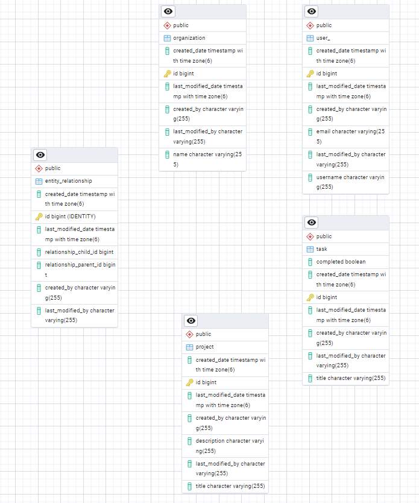

entity_relationship table:

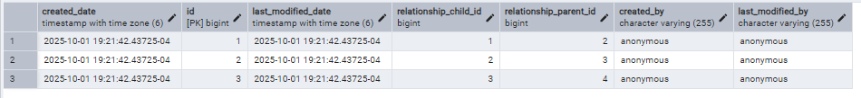

There is no relationship table in this approach.

---

## 4. Any Discriminator Approach

A **generic relationship table** stores a `type` and `id` pair to reference arbitrary entities. Uses Hibernate’s
`@Any` / `@AnyDiscriminator`.

### Key Points

- **Flexible**: Can link to any entity type dynamically.
- **No Foreign Keys**: Database does not enforce integrity. Hibernate resolves references.

### Pros

- Maximum flexibility for polymorphic relationships.
- Reduces need for multiple relationship tables.
- Useful for activity feeds, audit logs, metadata, etc.

### Cons

- No DB-level referential integrity (orphaned references possible).
- Harder to enforce constraints.
- Queries require extra care (joins by type/id).

### ERD Diagram

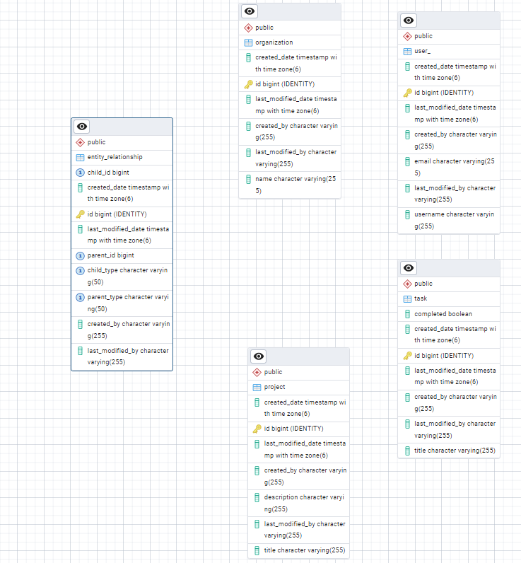

entity_relationship table:

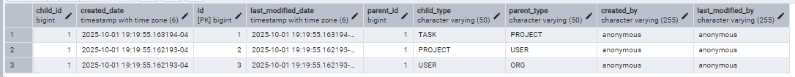

There is no relationship table in this approach.

---

## 5. One-to-One with Any Discriminator Approach

A refinement of the Any Discriminator pattern, but applied in a **one-to-one** relationship context.

### Key Points

- **One-to-One Polymorphism**: Each row in an entity (e.g. `User`, `Project`, `Task`, `Organization`) links to exactly
  one row in the `Relationship` table.
- **Discriminator Column**: The `Relationship` table holds a discriminator (`entity_type`) and target key (`entity_id`)
  to resolve back to the owner.
- **Referential Integrity**: Unlike the pure Any Discriminator approach, this design **does enforce DB-level integrity**
  via `relationship_id` foreign keys from entity tables into the `Relationship` table.

### Pros

- Retains flexibility of `@Any` while gaining stronger integrity guarantees.
- DB-level referential integrity is enforced (`relationship_id` is a proper FK).
- Clear one-to-one semantics: each entity has exactly one `Relationship`.

### Cons

- More rigid than the pure Any approach (not many-to-any).
- Slightly more tables and joins involved compared to simpler inheritance.

### ERD Diagram

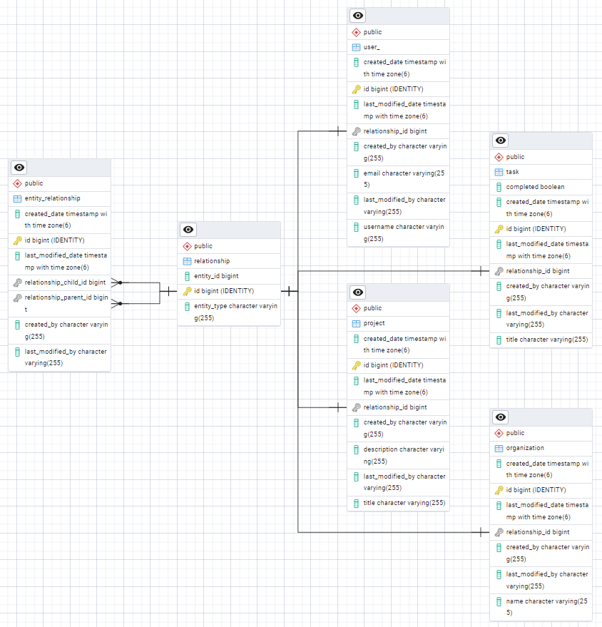

entity_relationship table:

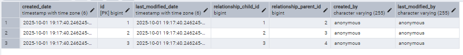
relationship table:

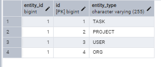

---

# Benchmark Results

The following results were obtained using **JMH benchmarks** on each inheritance/association strategy.

| Approach                           | Operation      | Avg Time (µs/op) | Error (µs/op) |
|------------------------------------|----------------|------------------|---------------|
| **Single Table**                   | fetchRandomOrg | 230.283          | ±65.968       |
|                                    | insertNewOrg   | 536.638          | ±358.074      |
| **Join Table**                     | fetchRandomOrg | 265.614          | ±262.397      |
|                                    | insertNewOrg   | 790.703          | ±886.336      |
| **Table Per Class**                | fetchRandomOrg | 252.662          | ±28.145       |
|                                    | insertNewOrg   | 457.687          | ±202.391      |
| **Any Discriminator**              | fetchRandomOrg | 236.679          | ±78.722       |
|                                    | insertNewOrg   | 555.785          | ±129.829      |
| **One-to-One + Any Discriminator** | fetchRandomOrg | 238.737          | ±23.863       |
|                                    | insertNewOrg   | 990.658          | ±227.675      |

### Observations

- **Fetch performance** is comparable across all approaches (~230–265 µs/op).
- **Insert performance** varies more significantly:
    - Fastest inserts: **Table Per Class** (~457 µs/op).
    - Slowest inserts: **One-to-One + Any Discriminator** (~990 µs/op), likely due to extra join and referential checks.
- **Single Table** provides a strong balance: good fetch speed and moderate insert cost.
- **Join Table** has the highest variance in inserts due to multiple joins.
- **Any Discriminator** is competitive in both fetch and insert, at the cost of referential integrity.
