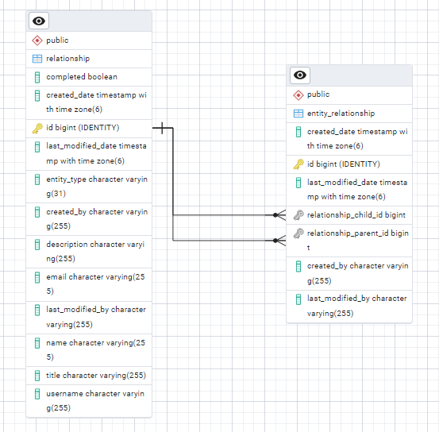

# Single Table Inheritance Approach

This repository demonstrates the **Single Table Inheritance (STI)** strategy for modeling inheritance in relational
databases. All entities in an inheritance hierarchy are stored in a single database table, differentiated by a type
discriminator column.

## Approach

- **Single Table**: All subclasses/entities share the same table.
- **Discriminator Column**: Identifies the type/subclass of each row.
- **Flexible Attributes**: Non-shared attributes are nullable or managed with default values.
- **Simple Queries**: Fetch records for the entire hierarchy or filter by type.

This approach is useful for scenarios with polymorphic relationships and straightforward data requirements.

## Use with EAV Model

STI is especially helpful when using the **Entity-Attribute-Value (EAV)** model to support custom fields or dynamic
attributes. It simplifies storing and querying heterogeneous data types within a single table structure.

## Advantages

- Simplifies schema management by reducing the number of tables.
- Easy to query all types at once.
- Good performance for small to medium-sized hierarchies.

## ERD Diagram

---

For more details on implementation, see the code and comments in this repository.